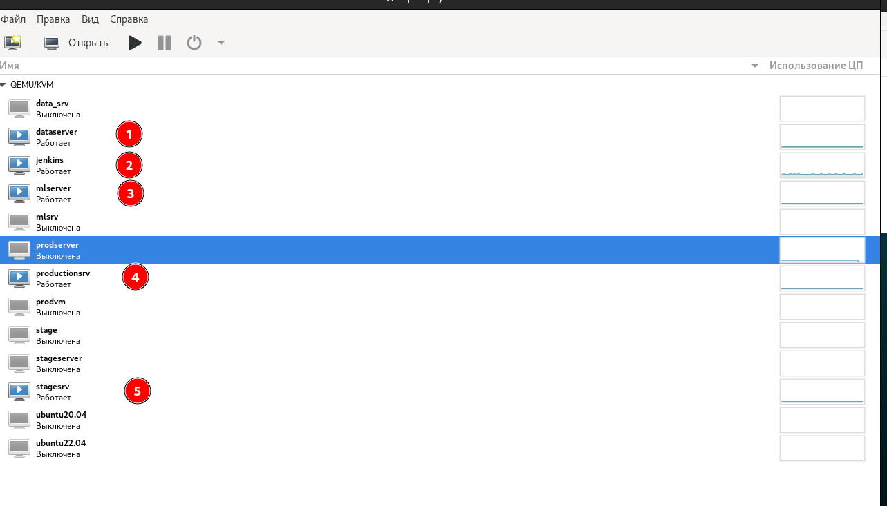
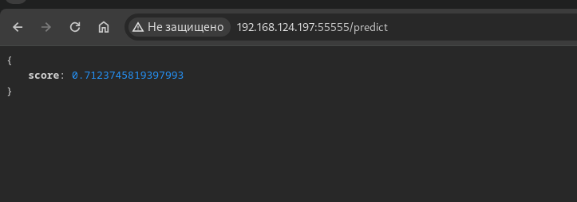
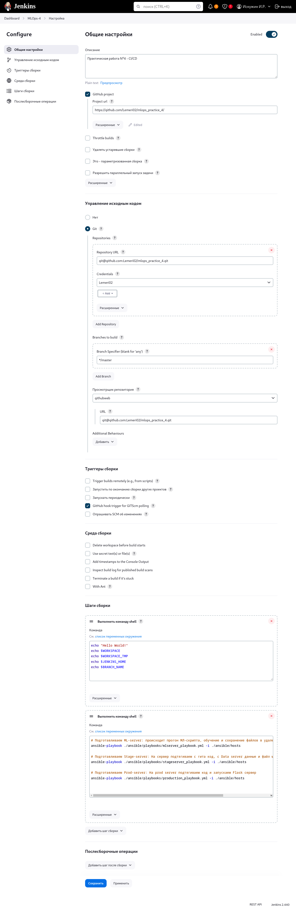

# MLOps. Практическое задание №4 (vo-HW)

## Общее описание проекта
1) Создал репозиторий git, инфраструктуру для хранения артефактов в dvc
2) Установил и настроил необходимые ПО (KVM, VScode, ssh-сервер, python и т.д.)
3) Установку необходимых библиотек python осуществил через venv и requirements.txt
4) Построил модель, определил метрику, задал гиперпараметры, провел эксперимент, сохранил эксперимент 
5) Провел сравнение метрик
6) Создал виртуальные машины для test и prod


## Инфраструктура
Инфраструктура - виртуальные машины развернул в libvirt:
1) Data-server - храним датасеты (DVC)
2) Admin-server - Jenkins и Ansible - с помощью этого сервера управляем остальными
3) ML-server - Обучение модели и загрузка датасета, модели в формате model.pkl в Data-server
4) Prod-server - Продакшн - Загрузка кода из Github репозитория, данных из Data-Server с помощью DVC и запуск Flask приложения
5) Stage-Server - Загрузка кода из Github репозитория, данных из Data-Server с помощью DVC и запуск теста с помощью pytest

Сначала в Jenkins запускается ansible playbook  
    - mlserver_playbook.yml - скачивает репозиторий из github на ML-server, скачивает датасет из внешнего источника, прогоняет скрипт dvc repro, и пушит данные в Data-server
    - stageserver_playbook.yml - скачивает репозиторий из github на Stage-server, устанавливает необходимые зависимости, скачивает данные из Data-server, прогоняет автотесты
    - production_playbook.yml - скачивает репозиторий из github на Stage-server, устанавливает необходимые зависимости, скачивает данные из Data-server, запускает Flask-приложение




## Демонстрация работы прода - Flask приложения 


## Jenkins настройки


## Вывод Jenkins 
```
Started by user Искужин И.Р.
Running as SYSTEM
Building in workspace /var/lib/jenkins/workspace/MLOps-4
The recommended git tool is: NONE
using credential cf0855e3-6158-4fe9-a7b7-46984027573b
 > git rev-parse --resolve-git-dir /var/lib/jenkins/workspace/MLOps-4/.git # timeout=10
Fetching changes from the remote Git repository
 > git config remote.origin.url git@github.com:Lemeri02/mlops_practice_4.git # timeout=10
Fetching upstream changes from git@github.com:Lemeri02/mlops_practice_4.git
 > git --version # timeout=10
 > git --version # 'git version 2.34.1'
using GIT_SSH to set credentials 
Verifying host key using known hosts file, will automatically accept unseen keys
 > git fetch --tags --force --progress -- git@github.com:Lemeri02/mlops_practice_4.git +refs/heads/*:refs/remotes/origin/* # timeout=10
 > git rev-parse refs/remotes/origin/master^{commit} # timeout=10
Checking out Revision 418347bb613da6ab7f2b699975ec4bddf8acad3f (refs/remotes/origin/master)
 > git config core.sparsecheckout # timeout=10
 > git checkout -f 418347bb613da6ab7f2b699975ec4bddf8acad3f # timeout=10
Commit message: "Fix production playbook"
 > git rev-list --no-walk 418347bb613da6ab7f2b699975ec4bddf8acad3f # timeout=10
[MLOps-4] $ /bin/sh -xe /tmp/jenkins7168763941428491634.sh
+ echo Hello World!
Hello World!
+ echo /var/lib/jenkins/workspace/MLOps-4
/var/lib/jenkins/workspace/MLOps-4
+ echo /var/lib/jenkins/workspace/MLOps-4@tmp
/var/lib/jenkins/workspace/MLOps-4@tmp
+ echo /var/lib/jenkins
/var/lib/jenkins

[MLOps-4] $ /bin/sh -xe /tmp/jenkins18040393068279585888.sh
+ ansible-playbook ./ansible/playbooks/mlserver_playbook.yml -i ./ansible/hosts

PLAY [Prepare ML Server] *******************************************************

TASK [Gathering Facts] *********************************************************
ok: [mlserver]

TASK [ping] ********************************************************************
changed: [mlserver]

TASK [Pull from Git] ***********************************************************
changed: [mlserver]

TASK [Сreate venv] *************************************************************
changed: [mlserver]

TASK [Give permissions to an existing file] ************************************
ok: [mlserver]

TASK [Install requirements] ****************************************************
changed: [mlserver]

TASK [Run venv] ****************************************************************
changed: [mlserver]

TASK [Get data] ****************************************************************
changed: [mlserver]

TASK [Run DVC repro] ***********************************************************
changed: [mlserver]

PLAY RECAP *********************************************************************
mlserver                   : ok=9    changed=7    unreachable=0    failed=0    skipped=0    rescued=0    ignored=0   

+ ansible-playbook ./ansible/playbooks/stageserver_playbook.yml -i ./ansible/hosts

PLAY [Prepare stage server] ****************************************************

TASK [Gathering Facts] *********************************************************
ok: [stageserver]

TASK [ping] ********************************************************************
changed: [stageserver]

TASK [Pull from Git] ***********************************************************
changed: [stageserver]

TASK [Сreate venv] *************************************************************
changed: [stageserver]

TASK [Install requirements] ****************************************************
changed: [stageserver]

TASK [Install dvc ssh] *********************************************************
changed: [stageserver]

TASK [Run venv] ****************************************************************
changed: [stageserver]

TASK [Set DVC password] ********************************************************
changed: [stageserver]

TASK [Run DVC pull] ************************************************************
changed: [stageserver]

TASK [Run tests] ***************************************************************
changed: [stageserver]

PLAY RECAP *********************************************************************
stageserver                : ok=10   changed=9    unreachable=0    failed=0    skipped=0    rescued=0    ignored=0   

+ ansible-playbook ./ansible/playbooks/production_playbook.yml -i ./ansible/hosts

PLAY [Prepare Prod server] *****************************************************

TASK [Gathering Facts] *********************************************************
ok: [prodserver]

TASK [ping] ********************************************************************
changed: [prodserver]

TASK [Pull from Git] ***********************************************************
changed: [prodserver]

TASK [Сreate venv] *************************************************************
changed: [prodserver]

TASK [Install requirements] ****************************************************
changed: [prodserver]

TASK [Run venv] ****************************************************************
changed: [prodserver]

TASK [Install dvc ssh] *********************************************************
changed: [prodserver]

TASK [Set DVC password] ********************************************************
changed: [prodserver]

TASK [Run DVC pull] ************************************************************
changed: [prodserver]

TASK [Installing flask module] *************************************************
ok: [prodserver]

TASK [run flask app] ***********************************************************
changed: [prodserver]

PLAY RECAP *********************************************************************
prodserver                 : ok=11   changed=9    unreachable=0    failed=0    skipped=0    rescued=0    ignored=0   

Finished: SUCCESS
```

## Планы на улучшение
- все пути в директории и т.д. вынести в переменные окружения
- секреты вынести в ansible-vault с шифрованием
- все эксперименты, запуск кода, тестов, прода выполнять в контейнерах (docker)

